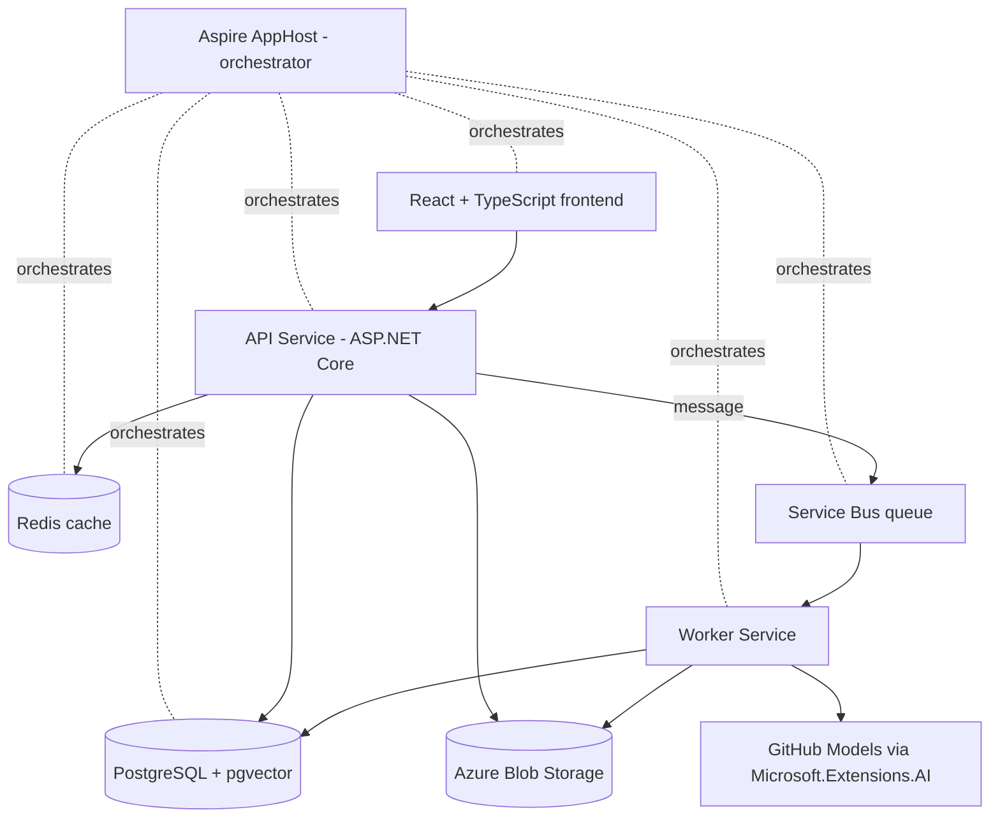

# AI Document Manager


A learning project exploring **distributed application development with .NET Aspire** and
**AI-powered document processing**. Documents are uploaded through a React frontend,
stored in Azure Blob Storage, processed asynchronously by a background worker, and
enriched with AI-generated summaries and tags.

## Features

- 📄 **Document management** — upload, download and delete files through a React + TypeScript UI
- ☁️ **Cloud storage** — files live in Azure Blob Storage with passwordless (Entra ID) auth
- ⚙️ **Asynchronous processing** — Service Bus queue + worker service with PeekLock,
  retry and dead-lettering
- 🤖 **AI analysis** — text extraction (plain text, PDF), summary and tag generation
  via GitHub Models behind the `Microsoft.Extensions.AI` abstraction
- 🔍 **Semantic search** — documents are chunked and embedded (pgvector + HNSW index);
  search works by meaning, across languages
- ⚡ **Redis output caching** — with tag-based invalidation on writes
- 🔭 **Full observability** — logs, metrics and distributed traces in the Aspire dashboard

## Architecture



The AppHost describes the whole system in C#: it starts the containers
(PostgreSQL, Redis, Service Bus emulator), provisions the Azure resources
(storage account, RBAC), wires connection strings into the services as
environment variables, and hosts the dashboard.

| Component | Technology | Purpose |
|---|---|---|
| `AiDocMngmnt.AppHost` | Aspire 13 | Orchestration, provisioning, dashboard |
| `AiDocMngmnt.Server` | ASP.NET Core minimal API | Document endpoints, upload/download |
| `AiDocMngmnt.Worker` | .NET worker service | Queue consumer, text extraction, AI analysis |
| `AiDocMngmnt.Data` | EF Core + Npgsql | Shared entities, DbContext, migrations |
| `AiDocMngmnt.ServiceDefaults` | OpenTelemetry, health checks | Shared service configuration |
| `frontend` | React 19 + TypeScript + Vite | Web UI |

## Getting started

### Prerequisites

- [.NET 10 SDK](https://dotnet.microsoft.com/download)
- [Docker Desktop](https://www.docker.com/products/docker-desktop/) (PostgreSQL, Redis and the Service Bus emulator run in containers)
- [Node.js](https://nodejs.org/) 22+
- [Azure CLI](https://learn.microsoft.com/cli/azure/install-azure-cli) with an Azure subscription (free tier is enough) — blob storage is provisioned automatically
- A GitHub fine-grained personal access token with the **Models: Read-only** account permission (free tier)

### Setup

```bash
# 1. Sign in to Azure (the app provisions storage into your subscription)
az login

# 2. Configure Azure provisioning (AppHost user secrets)
dotnet user-secrets set "Azure:SubscriptionId" "<your-subscription-id>" --project AiDocMngmnt.AppHost
dotnet user-secrets set "Azure:Location" "germanywestcentral" --project AiDocMngmnt.AppHost
dotnet user-secrets set "Azure:ResourceGroup" "rg-aidocmngmnt-dev" --project AiDocMngmnt.AppHost
dotnet user-secrets set "Azure:AllowResourceGroupCreation" "true" --project AiDocMngmnt.AppHost
dotnet user-secrets set "Azure:CredentialSource" "AzureCli" --project AiDocMngmnt.AppHost

# 3. Configure the GitHub Models API key
dotnet user-secrets set "Parameters:github-models-key" "<your-github-pat>" --project AiDocMngmnt.AppHost
```

### Run

```bash
aspire run
```

Open the dashboard login URL printed to the console; the `webfrontend`
resource links to the web UI. On first run Aspire provisions the Azure
storage account, which takes a minute or two.

> **Tip:** some regions (e.g. `westeurope`) may reject new deployments with
> "region not accepting new customers" — pick another region in that case.

## How processing works

1. The API stores the uploaded file in blob storage, saves metadata to
   PostgreSQL, evicts the cached document list and drops a message onto the
   `documents-to-process` queue.
2. The worker picks up the message (PeekLock), downloads the blob, extracts
   the text (PdfPig for PDFs) and asks the model for a summary and tags using
   typed structured output.
3. Status transitions `Uploaded → Processing → Processed` are visible live in
   the UI. Failures are retried up to 3 times, then dead-lettered and marked
   `Failed`.

## Roadmap

- [x] Aspire scaffold: AppHost + API + React frontend
- [x] Data layer: PostgreSQL (pgvector image) + EF Core + Redis
- [x] File storage: Azure Blob Storage with automatic provisioning
- [x] Async processing: Service Bus + worker service
- [x] AI analysis: text extraction, summary, tags
- [x] Semantic search: embeddings + pgvector
- [ ] RAG chat over documents

## Notes

This is a learning project. Some production concerns are intentionally
simplified and documented as future work: the outbox pattern for atomic
DB+queue writes, orphaned blob cleanup, upload size limits, OCR for images,
and authentication.
